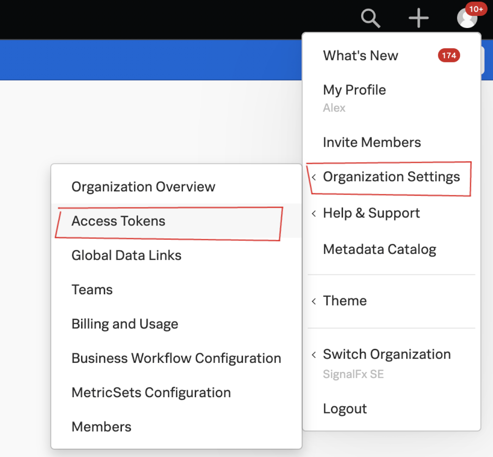
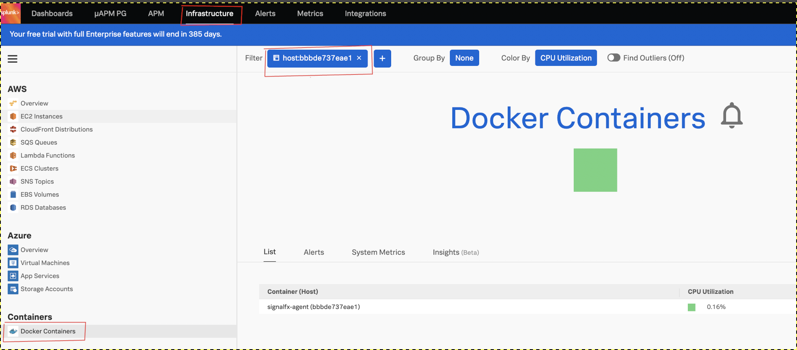

# Instrumenting Ruby with SignalFX
> Tested in MacOS Catalina 10.15.7


## Checkout signalfx-demos repo

`git clone` 
- Install SignalFX Smart Agent

## Configure the SignalFX agent

```
cd docker
mkdir -p /etc/signalfx/
```

- Set SignalFX token and hostname

- Get your token from the SignalFx UI

`https://app.signalfx.com/`




- Replace token in the `agent.yaml` file

`vi agent.yaml`

`signalFxAccessToken: YOUR_SIGNALFX_ACCESS_TOKEN`


- Get your hostname
Run

```
hostname
C255HMD6RXX
```
- Replace hostname in the `agent.yaml` file

`vi agent.yaml`

`environment: "C255HMD6RXX"`

## Run the agent

```
cd docker 
./run
```

## Test your agent


- Check that the the port forward and the the agent is listning on port 9080

```
docker ps


CONTAINER ID   IMAGE                                   COMMAND                 CREATED        STATUS        PORTS                    NAMES
bbbde737eae1   quay.io/signalfx/signalfx-agent:5.7.1   "/bin/signalfx-agent"   16 hours ago   Up 16 hours   0.0.0.0:9080->9080/tcp   signalfx-agent

sudo lsof -i tcp:9080

COMMAND    PID  USER   FD   TYPE             DEVICE SIZE/OFF NODE NAME
com.docke 3112 adiaz   85u  IPv6 0xa341aecd732f2011      0t0  TCP *:glrpc (LISTEN)

```

```
docker ps
CONTAINER ID   IMAGE                                   COMMAND                 CREATED        STATUS        PORTS                    NAMES
bbbde737eae1   quay.io/signalfx/signalfx-agent:5.7.1   "/bin/signalfx-agent"   16 hours ago   Up 16 hours   0.0.0.0:9080->9080/tcp   signalfx-agent

```

### Find your agent in the SignaFX UI using the agent docker id




## Verify docker logs

docker logs -f signalfx-agent


## Test a trace on the agent

```
curl -X POST "http://localhost:9080/v1/trace" -H "accept: application/json" -H "content-type: application/json" -d '[ { "id": "352bff9a74ca9ad2", "traceId": "5af7183fb1d4cf5f", "name": "get /api", "timestamp": 1556604172355737, "duration": 1431, "kind": "SERVER", "localEndpoint": { "serviceName": "alex", "ipv4": "192.168.99.1", "port": 3306 }, "remoteEndpoint": { "ipv4": "172.19.0.2", "port": 58648 }, "tags": { "http.method": "GET", "http.path": "/api" } }]'

```
> If successful you'll see `OK` in the response

```
 curl -X POST "http://localhost:9080/v1/trace" -H "accept: application/json" -H "content-type: application/json" -d '[ { "id": "352bff9a74ca9ad2", "traceId": "5af7183fb1d4cf5f", "name": "get /api", "timestamp": 1556604172355737, "duration": 1431, "kind": "SERVER", "localEndpoint": { "serviceName": "alex", "ipv4": "192.168.99.1", "port": 3306 }, "remoteEndpoint": { "ipv4": "172.19.0.2", "port": 58648 }, "tags": { "http.method": "GET", "http.path": "/api" } }]'
"OK"
```

> And you'll see a entry similar to this in the logs

```
time="2021-01-12T19:29:52Z" level=debug msg="Could not find source of span &{5af7183fb1d4cf5f 0xc002021440 <nil> 352bff9a74ca9ad2 0xc002021450 0xc001d0ac70 0xc001d0ac78 <nil> <nil> 0xc001456120 0xc001456140 [] map[environment:C02D255HMD6R host:bbbde737eae1 http.method:GET http.path:/api signalfx.smartagent.version:5.7.1] map[data_source_ip:172.17.0.1 signalfx-endpoint:<nil>]} with sourceIP 172.17.0.1"
time="2021-01-12T19:29:52Z" level=debug msg="Tracking environment name from trace span" environment=C02D255HMD6R
time="2021-01-12T19:29:52Z" level=debug msg="Tracking service name from trace span" service=alex
```

> Your agent is ready and collecting traces


## Setup Environment variables
> Please not the `.` in front to the script

`. ./env`

## Run the ruby apps

```
cd ruby
./hello.rb
./hello_world.rb -p 4570

```

## Acces the app to generate traces

`http://127.0.0.1:4567/`

`http://localhost:4570/`


## Analyze the traces in the SignalFX UI


